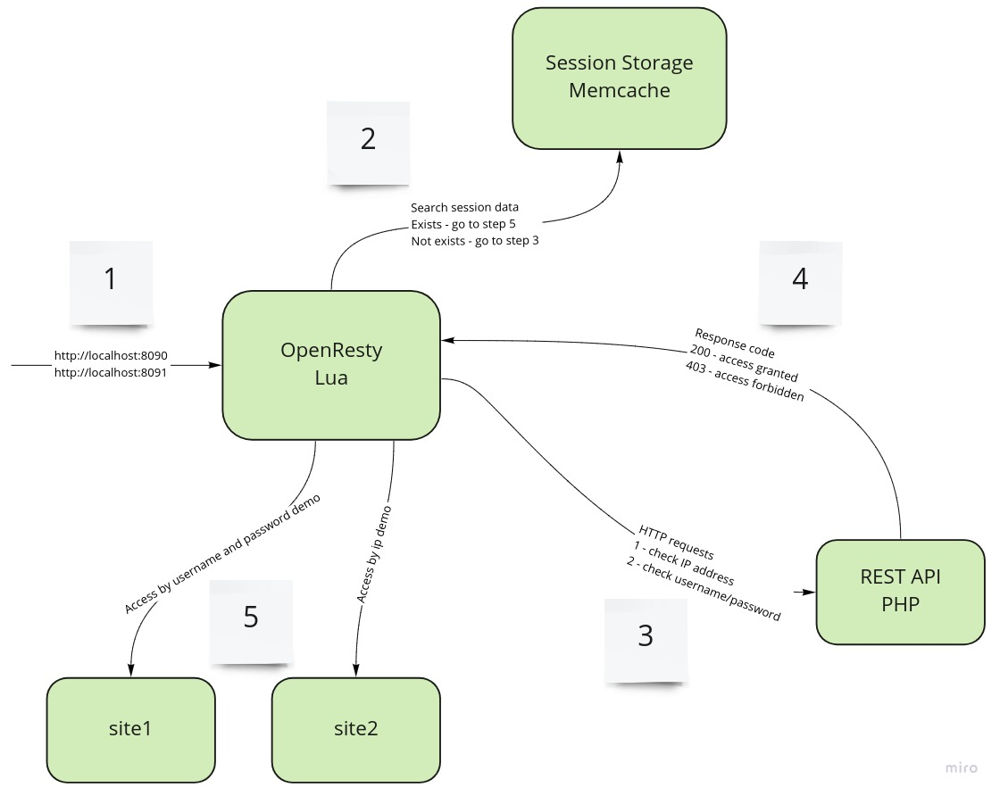

# OpenResty Auth Middleware

Example of basic digest authentication as middleware in nginx (OpenResty).



## What is included

* [OpenResty](https://openresty.org/) - enhanced version of nginx with LuaJIT support.
* [Memcached](https://memcached.org/) - in-memory storage.
* [PHP](https://php.net) - interpreter for php scripts.

## Run the demo

Use [Docker](https://www.docker.com/) for quick start.

```bash
docker-compose up --build
```

1) Open browser `http://127.0.0.1:8090/`. Enter username `test` and password `test`. Done!
2) Open browser `http://127.0.0.1:8091/`. This page will be opened without authorization.

